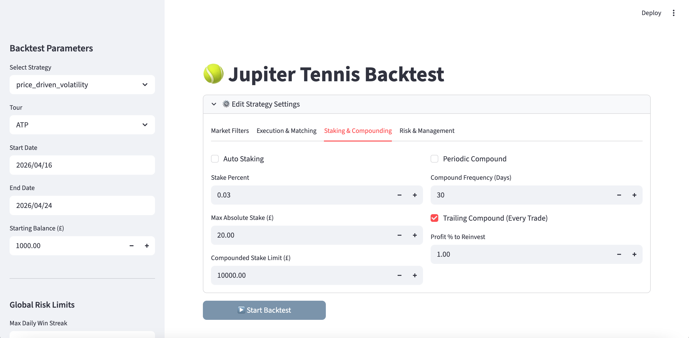

# Matthew Enubuje
### Technical Writer & Quantitative Data Analyst

Specialising in **developer documentation**, **real-world asset (RWA) protocols**, and **quantitative sports telemetry pipelines**. Bridging low-level system architecture, Python data modelling, and developer tooling into authoritative technical documentation and actionable data intelligence.

[LinkedIn](https://www.linkedin.com/in/matthew-e-7b161410b/) • [Email](mailto:matthew_enubuje@outlook.com) • [Location: London, UK]

---

## 🛠️ Core Technical Stack

### Languages & Data Modeling

### Data Infrastructure & Webhooks

### Documentation & Version Control

---

## 📂 Featured Technical Projects

### 1. Protocol Architecture & Developer Documentation: Quintes
**Focus:** Technical Writing • System Specifications • Tokenomic Mechanics  
🔗 **Live Docs:** [quintes.gitbook.io/quintes](https://quintes.gitbook.io/quintes)

Architected the complete public-facing documentation suite and developer knowledge base for an institutional Real-World Asset (RWA) protocol:

* **System Primitives & Tokenomics:** Structured comprehensive reference documentation defining dual-token models, overcollateralisation debt mechanisms, and algorithmic yield dynamics.
* **Liquidation & Risk Workflows:** Formulated clear technical specifications explaining liquidation triggers, PegKeepers, and stability pool operations for developers and institutional partners.
* **Information Architecture:** Built a standardised taxonomy separating high-level conceptual overviews from low-level smart contract integration parameters, accelerating partner onboarding.

📁 *Architecture Overview & Case Study: [`/docs/quintes-case-study.md`](./docs/quintes-case-study.md)*

---

### 2. Jupiter Tennis: Event-Driven Algorithmic Trading Engine
**Focus:** Systems Architecture • WebSocket Streaming • Finite State Machine (FSM)  
🔒 **Proprietary Commercial Pipeline** *(Codebase private; architectural breakdown and UI demo below)*

An automated, high-frequency, event-driven trading execution engine designed for live tennis exchange markets. The system bypasses REST polling limitations via direct WebSocket stream ingestion, local state synchronisation, and strict concurrency controls:

* **Low-Latency Streaming Architecture:** Built a zero-latency WebSocket stream listener (`betfairlightweight`) with packet conflation to process market books and order fills in milliseconds while remaining within rate constraints.
* **Deterministic Finite State Machine (FSM):** Implemented a thread-safe `TradingSession` lifecycle engine across discrete operational states (`OBSERVATION`, `TRANSACTION`, `PENDING_ENTRY`, `MANAGEMENT`, `PENDING_EXIT`) to prevent execution race conditions and double-order submission.
* **Local Order & Risk Cache:** Subscribed directly to private order streams, maintaining an in-memory cache to compute real-time gross profit, liability, and timeout logic locally without external round-trips.
* **Asynchronous Telemetry & Telemetry Persistence:** Deployed an `asyncio` background loop for real-time Telegram trade updates and built automated batch exporters persisting point-by-point match statistics, serve metrics, and execution logs to MongoDB.

<!-- Replace with your actual paths/assets -->

  

📁 *System Design & FSM Lifecycle Spec: [`/projects/jupiter-engine-architecture.md`](./projects/jupiter-architecture.md)*

---

### 3. Jupiter Backtesting & Quantitative Analytics Suite
**Focus:** Quantitative Analysis • Historical Simulation • Interactive Visualisation  
🔒 **Proprietary Research Ecosystem** *(Internal analytics hub; visual walkthrough below)*

A dedicated backtesting and quantitative simulation suite built in Python to evaluate algorithmic trading strategies, historical parameter sensitivity, and risk drawdowns across multi-season tennis datasets:

* **Discrete-Time Transition Modelling:** Built predictive models in Python (pandas, NumPy) designed specifically to forecast point-to-game and game-to-set transition states and match outcomes.
* **Historical Market Simulation:** Backtested execution logic against historical market data feeds, verifying fill assumptions, slippage constraints, and odds volatility.
* **Interactive Streamlit Analytics Dashboard:** Engineered a multi-parameter web interface allowing quantitative exploration of entry thresholds, surface splits (Clay, Hard, Grass), break-point conversions, and maximum drawdowns.
* **Telemetry Data Reconstruction:** Parsed chronological arrays of match dictionaries stored in MongoDB to reconstruct point-by-point match momentum curves and strategy equity paths.

<!-- Replace with your actual paths/assets -->

  

📁 *Quantitative Pipeline & Backtesting Breakdown: [`/projects/jupiter-backtesting-analysis.md`](./projects/jupiter-architecture.md)*

---

## 💼 Core Experience & Background

* **Technical Writer** | *Quintes* (Jul 2024 – Present · Contract)  
  * Designed and authored the complete technical documentation suite on GitBook, translating complex smart contract interactions, overcollateralisation parameters, and liquidation logic into structured developer references.
* **AI Evaluation & Alignment Specialist** | *Independent Technical Consultant* (Nov 2025 – Present · Contract)  
  * Evaluated and optimised frontier Large Language Model (LLM) responses across reinforcement learning from human feedback (RLHF) and fine-tuning pipelines, designing adversarial test cases and benchmarking multi-modal reasoning.
* **Senior Marketing Manager** | *TradrLab* (Feb 2022 – Jul 2024)  
  * Spearheaded product marketing and technical communications for a natural-language AI algorithmic trading platform, scaling early user adoption across quantitative finance and trading communities.
* **Business Developer & Sales** | *Facesoft* (Mar 2019 – Aug 2019)  
  * Executed hybrid technical writing, developer relations, and business development initiatives for an Imperial College London-incubated computer vision and AI facial recognition startup.

---

## 📄 Contact & Direct Inquiries
* Direct Email: `matthew_enubuje@outlook.com`
* Based in London, UK (Open to remote and hybrid technical writing / data roles)
