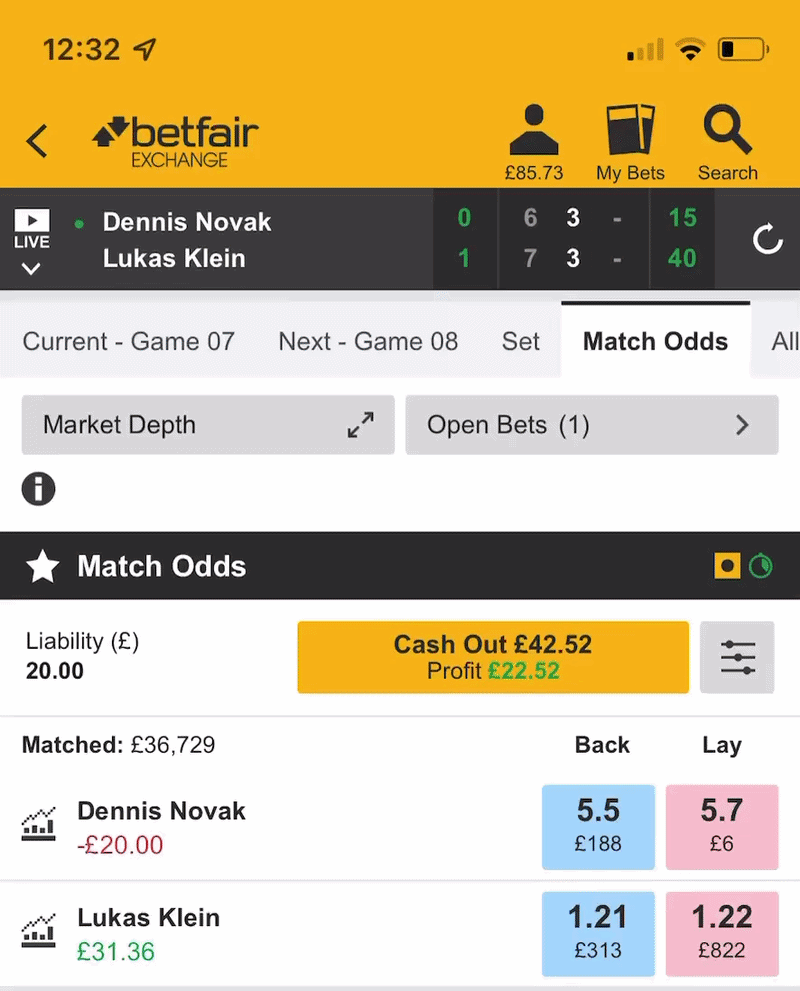

# Systems Architecture: Jupiter Event-Driven Trading Engine

**Role:** Quantitative Systems Architect & Systems Engineer  
**Focus:** Dual Ingestion (WebSockets & REST), Finite State Machines, Mobile Remote C2  
**Stack:** Python 3.10+, Asynchronous WebSockets, REST APIs, Telegram Bot API, Linux (Vultr VPS)  
**Status:** Proprietary Commercial Infrastructure (Codebase private; architectural breakdown and metrics below)

---

## 📌 Architectural Overview

Jupiter is an automated, event-driven algorithmic trading engine engineered for high-frequency prediction markets and central limit order book (CLOB) sports exchanges. 

Operating in fast-paced live sports markets introduces severe operational risks: REST polling rate limits, API timeouts, slippage during critical game points, and state ambiguity. Jupiter neutralises these bottlenecks by combining a dual-mode ingestion layer (hybrid WebSocket push streaming with fallback REST polling), a deterministic Finite State Machine (FSM), and a plug-and-play strategy interface.

  
   
  <em>Figure 1: Production daemon initialising on Linux VPS, compiling scenario matrix into RAM and spinning up session threads.</em>

---

## 🏗️ Ingestion & Execution Pipeline

The architecture strictly decouples market ingestion, execution logic, and remote operator controls.

<!-- Replace the path below once you export your diagram from Lucidchart -->

  
   
  <em>Figure 2: End-to-end execution pipeline from exchange push feeds to local state cache and remote controls.</em>

### 1. Dual Ingestion Layer: Streaming & Polling
* **Low-Latency Push Streaming:** Leverages direct TLS WebSockets with packet conflation (configurable, down to 500ms intervals) to capture market depth updates and order fill confirmations without polling overhead.
* **Automated REST Fallback:** Maintains a thread-safe REST polling engine (configurable interval, default 2s) to dynamically audit exchange state, verify token authorisations, and provide resilience against WebSocket disconnections.
* **Local In-Memory Cache:** Subscribes to private execution streams to locally track gross profit, exposure limits, and pending order expirations, avoiding external network hops during critical risk calculations.

---

## 🔄 Deterministic Finite State Machine (FSM)

To prevent race conditions, duplicate execution, or over-exposure during high-volatility events, every active market operates within a rigid state machine:

| State | Operational Behaviour | Concurrency Lock |
| :--- | :--- | :--- |
| **`OBSERVATION`** | Flat position (£0 liability). Stream listeners parse price delta matrices and order books against strategy parameters. | Unlocked |
| **`TRANSACTION`** | **Critical Mutex Lock.** Mid-API call dispatch (entry or hedge). Engine is locked to eliminate duplicate orders or race conditions. | **LOCKED** |
| **`PENDING_ENTRY`** | Order dispatched. Engine awaits the private Order Stream to confirm matched or partially matched volume. | Partially Locked |
| **`MANAGEMENT`** | Active exposure. Continuously calculates stop-loss, profit-take targets, and trailing hedging triggers. | Unlocked |
| **`PENDING_EXIT`** | Neutralisation order submitted. Synchronising with execution streams to confirm exposure return to zero. | **LOCKED** |

<!-- VIDEO OR GIF OF THE MATCH POSITION AUTO-CLOSING -->

  
   
  <em>Figure 3: Live match execution showing algorithmic position exit, automated profit neutralisation, and sub-second alert dispatch.</em>

